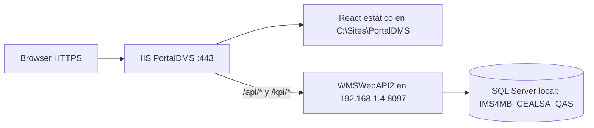

# Portal TOMWMSUX: arquitectura, datos, repositorios y permisos

> **Estado de este análisis:** describe la situación anterior a la publicación de permisos del 24/09/2026. Para la arquitectura y operación vigentes, consultar `brain/portal-operacion-permisos.md` en la rama `wms-brain` de `ejcalderongt/tomwms-replit-client-automate`.

Verificado el 2026-09-24 en `cealsa-02-srv`. Este documento describe el estado observado; no contiene credenciales ni tokens.

## Flujo en ejecución

- `C:\Sites\PortalDMS\web.config` usa URL Rewrite y ARR. `/api/*` se reescribe a `http://192.168.1.4:8097/api/*`; `/kpi/*` también llega al prefijo `/api/*` del backend. El resto de rutas del SPA vuelve a `index.html`.
- IIS conserva dos bindings HTTPS, para el dominio raíz y `www`. Los bindings del puerto 80 fueron retirados; HTTP no respondió en la comprobación posterior. Los puertos 8091 y 8097 son sitios API separados.
- El `server.js` de la versión Replit no se ejecuta en este despliegue estático; `/ai/chat` no está disponible aquí.
- El bundle publicado en IIS y un build local nuevo tienen nombres hash distintos. Un commit en Git no despliega automáticamente la versión nueva en IIS.

## Mapa del código React

| Archivo | Responsabilidad |
| --- | --- |
| `src/App.tsx` | Tabla de rutas React Router. Las pantallas de negocio pasan por `PrivateRoute`. |
| `src/components/Layout.tsx` | Menú lateral móvil y de escritorio, con enlaces escritos directamente en JSX. |
| `src/components/PrivateRoute.tsx` | Comprueba únicamente la presencia de token y usuario en `localStorage`. |
| `src/utils/auth.ts` | Guarda sesión en `wms_token`, `wms_user` y `wms_idPropietario`; no interpreta permisos. |
| `src/api/api.ts` | Cliente HTTP. `API_BASE=/api`; llamadas de documentos, stock, movimientos, bodegas y KPI. |
| `src/pages/Login.tsx` | Login de propietario y almacenamiento de la sesión. |
| `src/pages/Ingresos.tsx`, `src/pages/Salidas.tsx` | Fechas, filtros por propietario, tablas y navegación al detalle. |
| `vite.config.ts` | Alias `@`, build `dist`, proxy de desarrollo; el proxy apunta a una dirección distinta del IIS local y debe configurarse por ambiente antes de desarrollar. |

El menú contiene Inventario en Línea, Ingresos, Salidas, cinco KPI operativos, siete pantallas de análisis, Asistente de Inventario y Automatizaciones. El submenú de Indicadores aparece dos veces en el JSX (móvil y escritorio); cualquier control futuro debe usar una sola definición de opciones para evitar diferencias.

## Contrato API y datos verificados

| Operación | Ruta pública | Origen en SQL |
| --- | --- | --- |
| Login de propietario | `POST /api/Auth/login-propietario` | `Propietarios` y validación legacy. Devuelve JWT y propietario. |
| Ingresos | `POST /api/sync/ingresos/documentos-ingreso/listar` | `VW_OrdenCompra`, filtrada por `Activo`, fecha de creación, bodega y `IdPropietario`. |
| Salidas | `POST /api/sync/salidas/documentos-salida/listar` | `VW_PEDIDOS_LIST`, filtrada por `Activo`, `Fecha_Pedido`, bodega y `IdPropietario`. |
| Stock | `GET /api/Stock/listar` | `vw_stock_res`. |
| KPI | `/kpi/Kpi/*` en IIS | `api/Kpi/*` en WMSWebAPI2. |

La conexión activa `CST` usa SQL Server local y la base `IMS4MB_CEALSA_QAS`. Para el propietario 1 (manuchar), el login y la consulta de stock devolvieron HTTP 200. La base tiene 1,272 salidas activas; cinco caen entre el 1 y el 31 de agosto de 2026, y la API pública devolvió exactamente cinco con el mismo filtro. No hay órdenes de ingreso asociadas a este propietario ni en `trans_oc_enc` ni en `VW_OrdenCompra`: el rango 24/01/2021–24/09/2026 devolvió cero tanto en la API como en SQL. La vista contiene 1,070 ingresos de otros dos propietarios; no es un fallo del filtro React. El mes actual predeterminado de Salidas también devuelve cero para manuchar.

## Fuente de verdad y traslado a Azure DevOps

- Fuente de verdad acordada para el trabajo nuevo: Azure DevOps `ejcalderon0892/TOMWMSReact`, rama `dev_replit`. GitHub `ejcalderongt/tomwmsreact`, rama `dev_replit`, se conserva como espejo.
- Checkout local: `TOMWMSReact` en `dev_replit`, siguiendo `origin/dev_replit` (Azure). `github` sigue disponible como remoto secundario.
- Antes de este documento, GitHub `dev_replit`, el checkout local y Azure `main` apuntaban a `f7b247f`; la rama GitHub recibió 239 commits mediante avance rápido desde su ancestro `70a4b4a`.
- Tras autenticar Azure, se comprobó que `main` remoto estaba en `f7b247f` y que `dev_replit` no existía. Se creó `dev_replit` en Azure sin forzar, a partir de GitHub, y se verificó el SHA remoto `edeab60`. `main` no se cambió.
- Flujo de cambios: trabajar en la rama local `dev_replit`, revisar build y diff, publicar primero en Azure `origin`, verificar SHA y luego actualizar el espejo GitHub. No hacer push forzado. El despliegue IIS requiere un paso separado de build, copia y validación.
- El repositorio versiona 2,678 archivos bajo `node_modules` y cinco bajo `dist`. Retirarlos requiere un cambio controlado posterior; no mezclar esa limpieza con el traslado inicial.

## Estado de roles y menús

**No existe control de opciones por rol en el portal React.** `Layout.tsx` muestra enlaces fijos, `PrivateRoute` solo detecta una sesión guardada y `authAPI.login` conserva `token` y `propietario`, sin permisos. El login de propietario en `AuthController` emite la claim `rol=admin` de forma fija; no consulta un rol del propietario. No hay un identificador de propietario en las claims mostrado por ese método.

La base tiene `rol` (11 registros activos), `menu_sistema` (256) y `menu_rol` (1,026), con campos `visible`, `leer`, `modificar` y `eliminar`. Los títulos y nombres lógicos observados (`pgEmpresa`, `mnuMantEmpresa`, etc.) corresponden al menú del WMS anterior. No se encontró consumo de esas tablas en las pantallas React ni en las rutas API revisadas; `rol_menu` está vacío. Pueden servir como referencia de concepto, pero no como catálogo directo de rutas del portal.

**La API todavía no aplica autorización a los datos del portal.** Las consultas públicas de ingresos, salidas y stock devolvieron HTTP 200 sin JWT. Los controladores revisados no tienen `[Authorize]` y `UseAuthorization()` por sí solo no protege esas acciones. Ocultar enlaces en React no impide abrir URLs o llamar a la API directamente.

### Diseño recomendado para habilitar permisos

1. Definir roles y permisos propios del portal, por ejemplo `inventario.ver`, `ingresos.ver`, `salidas.ver`, `kpi.ver`, `analisis.ver`, y separar permisos de lectura de acciones mutadoras. Decidir explícitamente si el rol se asigna a cada usuario o al propietario; el login actual identifica al propietario, no a un operador individual.
2. Persistir asignaciones en backend y devolver en el login (o en `/api/me`) la identidad, `IdPropietario` y permisos efectivos. Emitir claims reales, sin `rol=admin` fijo. Definir expiración y revocación.
3. Exigir autenticación y autorización en los endpoints correspondientes. Tomar `IdPropietario` de la identidad validada para consultas de propietario, sin confiar en el valor enviado por el navegador; probar 401 sin token, 403 sin permiso y aislamiento entre propietarios.
4. Centralizar una tabla de rutas y permisos en React. Usarla para renderizar ambos menús y proteger rutas directas. Mostrar una pantalla de acceso denegado cuando corresponda.
5. Probar matrices de roles en UI y API, incluidas rutas de detalle, KPI y operaciones de escritura. Desplegar backend y frontend de manera coordinada para que el menú no prometa permisos que la API aún no concede.

Hasta completar el paso 3, los filtros de menú solo son una preferencia visual; no representan una restricción de acceso segura.
